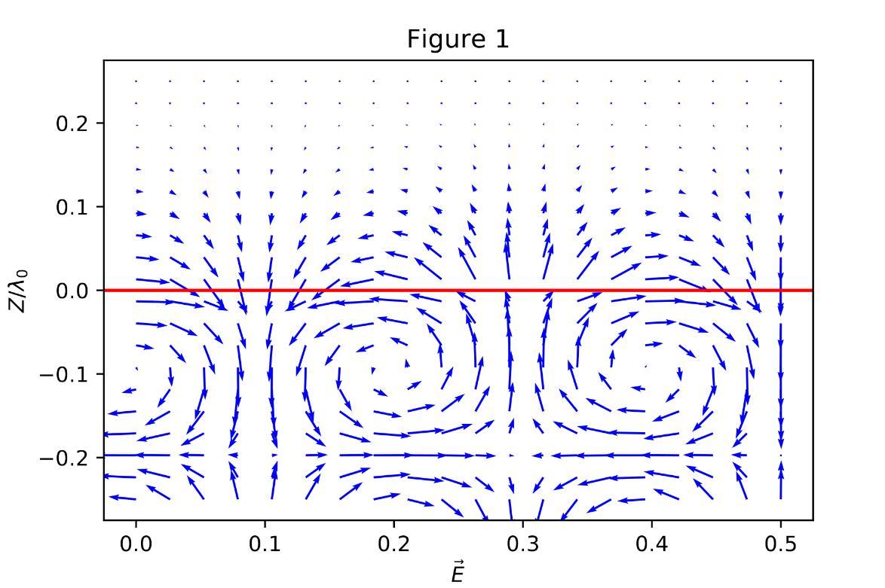
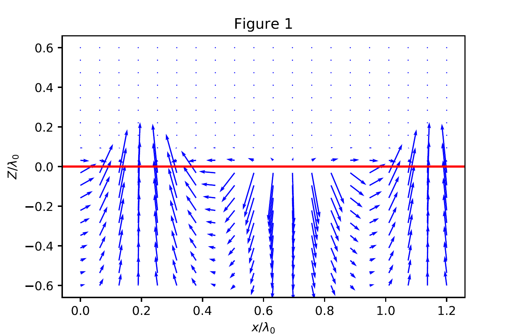
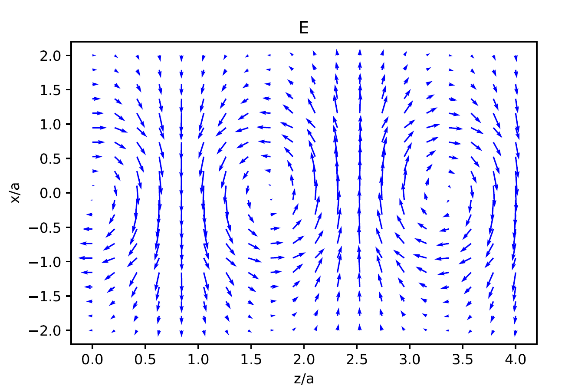
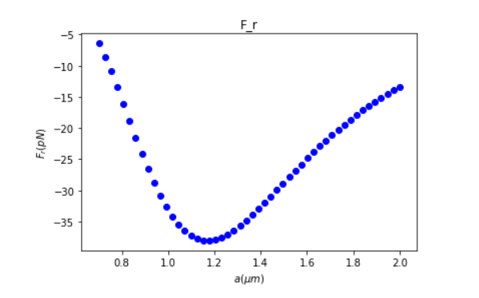
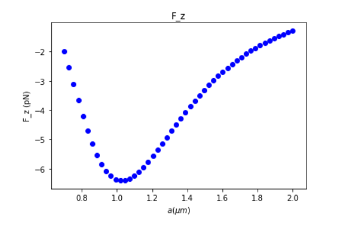

Evanescent electromagnetic waves possess spin-momentum locking, where the direction of propagation (momentum) is locked to the inherent polarization of the wave (transverse spin). We study the optical forces arising from this universal phenomenon and show that the fundamental origin of recently reported non-trivial optical chiral forces is spin-momentum locking. For evanescent waves, we show that the direction of energy flow, the direction of decay, and the direction of spin follow a right hand rule for three different cases of total internal reflection, surface plasmon polaritons, and HE₁₁ mode of an optical fiber. Furthermore, we explain how the recently reported phenomena of lateral optical force on chiral and achiral particles are caused by the transverse spin ofthe evanescent field and the spin-momentum locking phenomenon. Finally, we propose an experiment to identify the unique lateral forces arising from the transverse spin in the optical fiber and point to fundamental differences of the spin density from the well-known orbital angular momentum of light. Our work presents a unified view on spin-momentum locking and how it affects optical forces on chiral and achiral particles.

<p align="center">
    
</p>
<p align = "center">
    <em>Figure 1: Direction of transverse spin in evanescent fields for (a) total internal reflection</em>
</p>     

<p align = "center">
    
</p>
<p align = "center">
    <em>Figure 2: Direction of transverse spin in evanescent fields for (b) surface plasmon polariton</em>
</p>   

<p align = "center">
    
</p>
<p align = "center">
    <em>Figure 3: Direction of transverse spin in evanescent fields for  (c) optical fiber</em>
</p>

<p align = "center">
    
</p>
<p align = "center">
    <em>Figure 4: Time averaged optical force in different directions plotted versus radius of the fiber.</em>
</p>   

<p align = "center">
    
</p>
<p align = "center">
    <em>Figure 5: Time averaged optical force in different directions plotted versus radius of the fiber.</em>
</p>   

<p align = "center">
    
</p>
<p align = "center">
    <em>Figure 6: Time averaged optical force in different directions plotted versus radius of the fiber.</em>
</p>   

### References

*¹K. Y. Bliokh, A. Y. Bekshaev, and F. Nori, “Extraordinary momentum and spin in evanescent waves,”Nat. Commun.5, 3300 (2014).
<br><br>
²K. Y. Bliokh and F. Nori, “Transverse spin of a surface polariton,”Phys.Rev. A85, 061801 (2012).
<br><br>
³T. Van Mechelen and Z. Jacob, “Universal spin-momentum locking of evanescent waves,”Optica3, 118 (2016).
<br><br>
⁴F. L. Kien and A. Rauschenbeutel, “Negative azimuthal force of nanofiber-guided  light  on  a  particle,”Phys.  Rev.  A88,  063845(2013).
<br><br>
⁵K. Y. Bliokh, D. Smirnova, and F. Nori, “Quantum spin Hall effect of light,”Science348, 1448–1451 (2015).
<br><br>
⁶A. Aiello, N. Lindlein, C. Marquardt, and G. Leuchs, “Transverse angular momentum and geometric spin hall effect of light,”Phys. Rev. Lett.103,100401 (2009).
<br><b⁹r>
⁷F. J. Rodrguez-Fortuo, G. Marino, P. Ginzburg, D. OConnor, A. Martnez,G. A. Wurtz, and A. V. Zayats, “Near-field interference for the unidirectional excitation of electromagnetic guided modes,”Science340, 328–330(2013).
<br><br>
⁸P. V. Kapitanova, P. Ginzburg, F. J. Rodrguez-Fortuo, D. S. Filonov, P.M. Voroshilov, P. A. Belov, A. N. Poddubny, Y. S. Kivshar, G. A. Wurtz,and A. V. Zayats, “Photonic spin Hall effect in hyperbolic metamaterials for  polarization-controlled  routing  of  subwavelength  modes,”Nat.Commun.5, 3226 (2014).
<br><br>
⁹R.¹Mitsch,  C.  Sayrin,  B.  Albrecht,  P.  Schneeweiss,  and  A.Rauschenbeutel, “Quantum state-controlled directional spontaneous emission of photons into a nanophotonic waveguide,”Nat. Commun.5, 5713(2014).
<br><br>
¹⁰J. Petersen, J. Volz, and A. Rauschenbeutel, “Chiral nanophotonic wave-guide interface based on spin-orbit interaction of light,”Science346,67–71 (2014).
<br><br>
¹¹B. le F¹eber, N. Rotenberg, and L. Kuipers, “Nanophotonic control of circular dipole emission,”Nat. Commun.6, 6695 (2015).
<br><br>
¹²I. Sllner, S. Mahmoodian, S. L. Hansen, L. Midolo, A. Javadi, G. Kiransk,T. Pregnolato, H. El-Ella, E. H. Lee, J. D. Song, S. Stobbe, and P. Lodahl,“Deterministic photonemitter coupling in chiral photonic circuits,”Nat.Nanotechnol.10, 775–778 (2015).
<br><br>
¹³A. Young, A. Thijssen, D. Beggs, P. Androvitsaneas, L. Kuipers, J. Rarity,S. Hughes, and R. Oulton, “Polarization engineering in photonic crystal waveguides for spin-photon entanglers,”Phys. Rev. Lett.115, 153901(2015).
<br><br>
¹⁴A. Aiello and P. Banzer, “Transverse spin of light for all wavefields,” e-printarXiv:1502.05350.
<br><br>
¹⁵S. Scheel, S. Y. Buhmann, C. Clausen, and P. Schneeweiss, “Directional spontaneous emission and lateral Casimir-Polder force on an atom close to a nanofiber,”Phys. Rev. A92, 043819 (2015).
<br><br>
¹⁶M. H. Alizadeh and B. M. Reinhard, “Transverse chiral optical forcesby chiral surface plasmon polaritons,”ACS Photonics2, 1780–1788(2015).
<br><br>
¹⁷A. Ashkin, “Acceleration and trapping of particles by radiation pressure,”Phys. Rev. Lett.24, 156–159 (1970).
<br><br>
¹⁸A. Ashkin, J. M. Dziedzic, J. E. Bjorkholm, and S. Chu, “Observation of a single-beam gradient force optical trap for dielectric particles,”Opt. Lett.11, 288 (1986).
<br><br>
¹⁹S. B. Wang and C. T. Chan, “Lateral optical force on chiral particles near a surface,”Nat. Commun.5, 3307 (2014).
<br><br>
²⁰A. Hayat, J. P. B. Mueller, and F. Capasso, “Lateral chirality-sorting optical forces,”Proc. Natl. Acad. Sci.112, 13190–13194(2015).
<br><br>
²¹R. P. Cameron, S. M. Barnett, and A. M. Yao, “Discriminatory optical force for chiral molecules,”New J. Phys.16(1), 013020 (2014).
<br><br>
²²F. J. Rodrguez-Fortuo, N. Engheta, A. <sup>2</sup>MMartnez, and A. V. Zayats, “Lateral forces on circularly polarizable particles near a surface,”Nat. Commun.6,8799 (2015).
<br><br>
²³M. V. Berry, “Optical currents,”J. Opt. A11(9), 094001 (2009).
<br><br>
²⁴M. Neugebauer, T. Bauer, A. Aiello, and P. Banzer, “Measuring the transverse spin density of light,”Phys.Rev.Lett.114, 063901(2015).
<br><br>
²⁵See supplementary material at http://dx.doi.org/10.1063/1.4941539 for full expressions and explanations.
<br><br>
²⁶T. Setl, A. Shevchenko, M. Kaivola, and A. T. Friberg, “Degree of polarization for optical near fields,”Phys. Rev. E66, 016615 (2002).  
<br><br>
²⁷A. Y. Bekshaev and M. S. Soskin, “Transverse energy flows in vectorial fields of paraxial beams with singularities,”Opt. Commun.271, 332–348 (2007).
<br><br>
²⁸G. P. Agrawal,Fiber-Optic  Communication  Systems, 3rd ed. (Wiley-Interscience, New York, 2002).*

### Python Code:

```python
import numpy as np
import pandas as pd 
import matplotlib.pyplot as plt
import math
import cmath
from scipy.linalg import expm
```

```python
epsilon_0 = 8.85e-12;
mu_0 = 1.26e-6;
N = 2     # N is the number of layers inclusing the two semi infinite layers so N>1
N_d = 1   # N_d is the resolution for distance of dipole from the surface
N_z = 20  # N_z is the resolution for calculationg the fields
N_x = 20
N_lambda = 1
N_kx = 1
```

```python
# alpha_** are the elements of the polarizability matrix

alpha_ee = 2
alpha_mm = 1
alpha_em = 0.1
alpha_me = alpha_em
```

```python
n = np.ones((N,1),dtype = complex)
# n is the refractive indecies for the N layers

permit = n**2
# permit is a Nx1 matrix of the permittivity of the layers
```


```python

if N-1 == 1:
    z = np.array([np.linspace(0, 0e-9, 2)])
    z = np.array([[z[0][1]]])
else:
    z = np.array([np.linspace(0, 0e-9, N-1)])
    
# Z is the position of the interfaces of the layers
```

```python
z_obs = np.array([np.linspace(-75e-9, 75e-9, N_z)]);  #this matrix shows the z component of the points in which the fields are being calculated
x = np.array([np.linspace(0, 150e-9, N_x)]); 

z_layer = np.ones((z_obs.shape), dtype = int);
```

```python
for i_layer in range(0,z_obs.shape[1]):
    if z_obs[0][i_layer] > 0:
        z_layer[0][i_layer] = z_layer[0][i_layer] + 1
```


```python
c_0 = 3e8;

if N_lambda == 1 :
    lambda_0 = np.array([np.linspace(300e-9, 300e-9, 2)])
    lambda_0 = np.array([[lambda_0[0][1]]])   
else:
    lambda_0 = np.array([np.linspace(300e-9, 300e-9, N_lambda)]) 


w = 2*np.pi*c_0/lambda_0
k_0 = w/c_0;

if N_kx == 1 :
    k_x = np.array([np.linspace(0, (k_0[0]*15*n[0])[0], 2)])
    k_x =  np.array([[k_x[0][1]]])
else:
    k_x = np.array([np.linspace(0, (k_0[0]*15*n[0])[0], N_kx)])
#c_0 is the speed of light in vacuum. w is the angular frequency. 
#lambda_0 is the wavelength in vacuum and k_0 is the wave number in vacuum.
```

```python
# [r, t]= meshgrid(k_x, lambda_0);

r_p = np.zeros((lambda_0.shape[1],k_x.shape[1]), dtype = complex)
t_p = np.zeros((lambda_0.shape[1],k_x.shape[1]), dtype = complex)
R_p = np.zeros((lambda_0.shape[1],k_x.shape[1]), dtype = complex)
T_p = np.zeros((lambda_0.shape[1],k_x.shape[1]), dtype = complex)

#t and r are Transmission and reflection for H and T and R are transmission and reflection for power.
r_s = np.zeros((lambda_0.shape[1],k_x.shape[1]), dtype = complex)
t_s = np.zeros((lambda_0.shape[1],k_x.shape[1]), dtype = complex)
R_s = np.zeros((lambda_0.shape[1],k_x.shape[1]), dtype = complex)
T_s = np.zeros((lambda_0.shape[1],k_x.shape[1]), dtype = complex)
```

```python
H_y = np.zeros((N_z, N_x), dtype = complex);
E_x = np.zeros((N_z, N_x), dtype = complex);
E_z = np.zeros((N_z, N_x), dtype = complex);
S_x = np.zeros((1, N_z), dtype = complex);
S_y = np.zeros((1, N_z), dtype = complex);
S_z = np.zeros((1, N_z), dtype = complex);
Le_x = np.zeros((1, N_z), dtype = complex);
Le_y = np.zeros((1, N_z), dtype = complex);
Le_z = np.zeros((1, N_z), dtype = complex);
Lm_x = np.zeros((1, N_z), dtype = complex);
Lm_y = np.zeros((1, N_z), dtype = complex);
Lm_z = np.zeros((1, N_z), dtype = complex);
U = np.zeros((1, N_z), dtype = complex);
```

```python
F_gf_matrix = np.zeros((N_lambda, N_kx, 3));
F_rp_matrix = np.zeros((N_lambda, N_kx, 3));
F_esd_matrix = np.zeros((N_lambda, N_kx, 3));
F_matrix = np.zeros((N_lambda, N_kx, 3));

ro = r_s;
# ro is W-LDOS defined in "Quantum nanophotonics using HMM" apendix C.

x_plot, z_plot = np.meshgrid(x/lambda_0, z_obs/lambda_0);
#k_x_normalized and lambda_normalized are used for plotting
```

```python
for i_d in range(0,N_d):
    for i_lambda in range(0,N_lambda):
        n[0] = 3.5;
        n[N-1] = 1;
        
        if N_kx == 1:
            k_x = np.array([np.linspace(k_0[i_lambda], k_0[i_lambda]/math.sqrt(2)*n[0], 2)])
            k_x = np.array([k_x[0][1]])
        else:
            k_x = np.array([np.linspace(k_0[i_lambda], k_0[i_lambda]/math.sqrt(2)*n[0], N_kx)])
            
        permit= n**2;
        for i_kx in range(0,N_kx):
            
            k_z = ((np.ones((N, 1),dtype = np.complex_)*(k_0[i_lambda-1]*n))**2 - k_x[i_kx-1]**2)**0.5
            #k_z is a Nx1 matrix of the wavenumbers along the z direction for rach layer
            
            M_p = np.identity(2,dtype = complex);
            for i_layer in range(0,N-1):
                 M_p = np.dot(M_p,np.dot(np.linalg.inv((np.array([[cmath.exp(1j*k_z[i_layer]*z[i_layer]),0],[0,cmath.exp(-1j*k_z[i_layer]*z[i_layer])]])))\
                ,np.dot(np.linalg.inv((np.array([[1, 1],[(k_z[i_layer]/permit[i_layer])[0], (-k_z[i_layer]/permit[i_layer])[0]]])))\
                ,np.dot((np.array([[1, 1],[(k_z[i_layer+1]/permit[i_layer+1])[0], (-k_z[i_layer+1]/permit[i_layer+1])[0]]]))\
                ,(np.array([[cmath.exp(1j*(k_z[i_layer+1]*z[i_layer])[0]), 0],[0, cmath.exp(-1j*(k_z[i_layer+1]*z[i_layer])[0])]]))))))
              
                
            #M is a 2x2 matrix which relates the amplitudes of the waves in the last layer to those of the first one
            M_s = np.identity(2,dtype = complex)
            for i_layer in range(0,N-1):
                 M_s = np.dot(M_s,np.dot(np.linalg.inv((np.array([[cmath.exp(1j*k_z[i_layer]*z[i_layer]),0],[0,cmath.exp(-1j*k_z[i_layer]*z[i_layer])]])))\
                ,np.dot(np.linalg.inv((np.array([[1, 1],[(k_z[i_layer])[0], (-k_z[i_layer])[0]]])))\
                ,np.dot((np.array([[1, 1],[(k_z[i_layer+1])[0], (-k_z[i_layer+1])[0]]]))\
                ,(np.array([[cmath.exp(1j*(k_z[i_layer+1]*z[i_layer])[0]), 0],[0, cmath.exp(-1j*(k_z[i_layer+1]*z[i_layer])[0])]]))))))
            
            
            t_p[i_lambda, i_kx] = (1/M_p[0, 0])*cmath.exp(1j*k_z[i_layer+1]*z[i_layer])
            r_p[i_lambda, i_kx] = M_p[1, 0]/M_p[0, 0]
            T_p[i_lambda, i_kx] = abs(t_p[i_lambda, i_kx])**2/abs(n[N-1])
            R_p[i_lambda, i_kx] = abs(r_p[i_lambda, i_kx])**2 
            
            t_s[i_lambda, i_kx] = (1/M_p[0, 0])*cmath.exp(1j*k_z[i_layer+1]*z[i_layer])
            r_s[i_lambda, i_kx] = M_p[1, 0]/M_p[0, 0]
            T_s[i_lambda, i_kx] = abs(t_s[i_lambda, i_kx])**2/abs(n[N-1])
            R_s[i_lambda, i_kx] = abs(r_s[i_lambda, i_kx])**2
            
            amp = np.zeros((2, N), dtype = complex)
            vamp = np.zeros((2, N), dtype = complex)
            amp[:,0] = np.array([[1 , r_p[0][0]]])
            
            for i_layer in range(1,N):
                amp[:,i_layer] = np.dot(np.dot(np.linalg.inv((np.array([[cmath.exp(1j*k_z[i_layer]*z[i_layer-1]),0],[0,cmath.exp(-1j*k_z[i_layer]*z[i_layer-1])]])))\
                ,np.dot(np.linalg.inv((np.array([[1, 1],[(k_z[i_layer]/permit[i_layer])[0], (-k_z[i_layer]/permit[i_layer])[0]]])))\
                ,np.dot((np.array([[1, 1],[(k_z[i_layer-1]/permit[i_layer-1])[0], (-k_z[i_layer-1]/permit[i_layer-1])[0]]]))\
                ,(np.array([[cmath.exp(1j*(k_z[i_layer-1]*z[i_layer-1])[0]), 0],[0, cmath.exp(-1j*(k_z[i_layer-1]*z[i_layer-1])[0])]]))))), amp[:,i_layer - 1])
                
            amp[1][-1] = 0    
            
            for i_point in range(0,N_z):
                temp2 = np.array([amp[:,(z_layer[0][i_point] - 1)]]).reshape(2,1)
                temp3 = np.array([np.exp(1j*k_x[i_kx]*x[0])])           
                temp = np.array([[cmath.exp(1j * k_z[z_layer[0][i_point] - 1] * z_obs[0][i_point]), cmath.exp(-1j * k_z[z_layer[0][i_point] - 1] * z_obs[0][i_point])]])
                H_y[i_point,:] = np.dot(np.dot(temp,temp2),temp3)
                
                
                temp4 = np.array([[cmath.exp(1j * k_z[z_layer[0][i_point] - 1] * z_obs[0][i_point]), -cmath.exp(-1j * k_z[z_layer[0][i_point] - 1] * z_obs[0][i_point])]])
                temp5 = np.array([amp[:,(z_layer[0][i_point] - 1)]]).reshape(2,1)
                temp6 = np.array([k_z[(z_layer[0][i_point] - 1)]/permit[(z_layer[0][i_point] - 1)]/epsilon_0**0.5*(mu_0**0.5)/k_0[0][i_lambda]*[np.exp(1j*k_x[i_kx]*x[0])]])
                E_x[i_point,:] = np.dot(np.dot(temp4,temp5),temp6)
                
                temp7 = np.array([[-cmath.exp(1j * k_z[z_layer[0][i_point] - 1] * z_obs[0][i_point]), -cmath.exp(-1j * k_z[z_layer[0][i_point] - 1] * z_obs[0][i_point])]])
                temp8 = np.array([amp[:,(z_layer[0][i_point] - 1)]]).reshape(2,1)
                temp9 = np.array([k_x[i_kx]/permit[(z_layer[0][i_point] - 1)]/epsilon_0**0.5*(mu_0**0.5)/k_0[0][i_lambda]*[np.exp(1j*k_x[i_kx]*x[0])]])
                E_z[i_point,:] = np.dot(np.dot(temp7,temp8),temp9)

```

```python
position = [200,200,380*4/3,380]
plt.figure(figsize = (200,200))
fig, ax = plt.subplots()
q = ax.quiver(x_plot,z_plot,E_x.real,E_z.real,color = "Blue")
plt.axhline(color='r', linestyle='-')
plt.title('Figure 1')
plt.xlabel(r"$ \vec E  $")
plt.ylabel(r"$ Z/\lambda_0  $")
plt.show()
```

